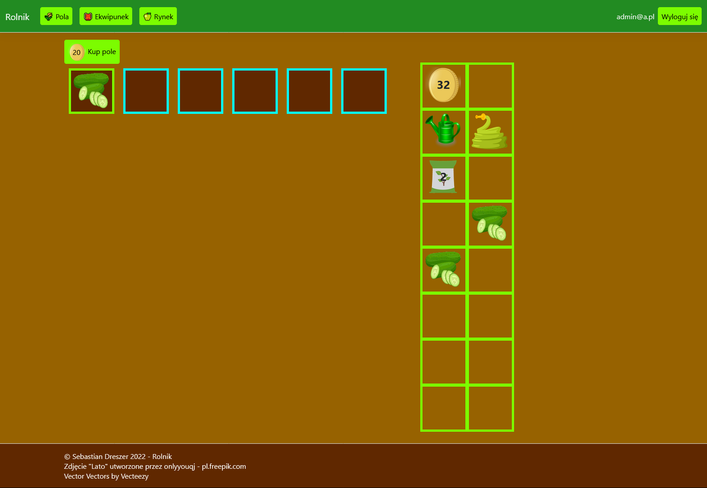
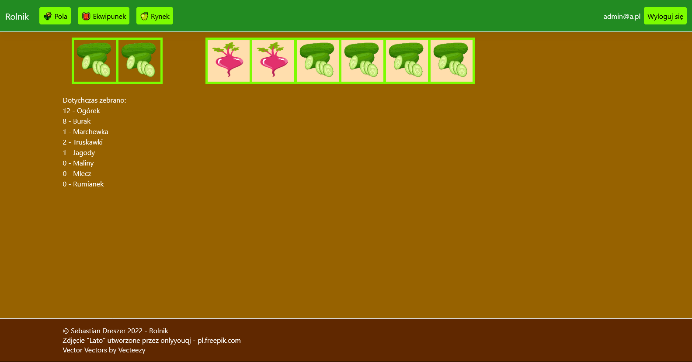
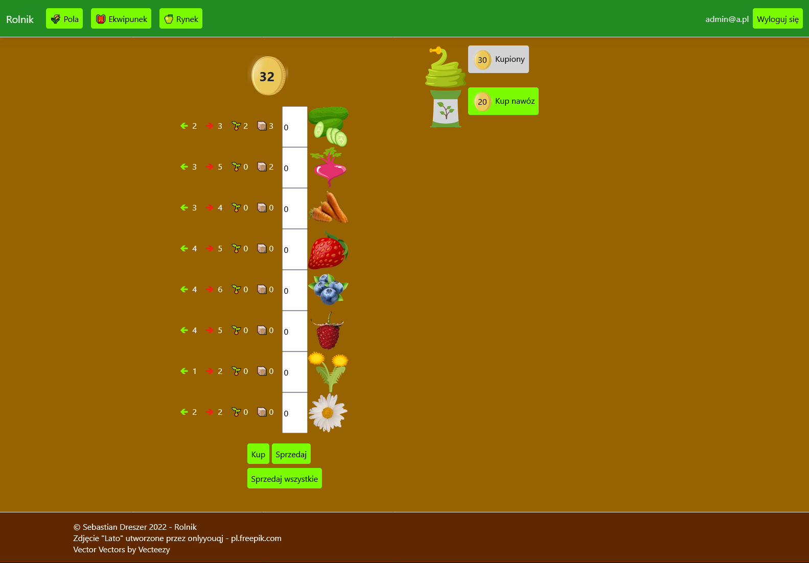

## PL
# Rolnik

**Technologie**
C#, ASP .NET MVC, Razor, ASP Identity 
JavaScript, jQuery 
Entity Framework, MS SQL Server 
SCCS

**Dane logowania** email: `admin@a.pl`, hasło: `Adm!n123`

Przeglądarkowa gra komputerowa o rolnictwie. Składa się z 3 części:
1. Pola — tutaj sadzi się i wyciąga wyrośnięte rośliny oraz podlewa i nawozi pola
2. Ekwipunek — tutaj można obejrzeć zakupione ziarna i zebrane rośliny
3. Rynek — miejsce kupna i sprzedaży roślin i wyposażenia

Utworzenie konta jest konieczne do grania m.in., aby zapisać stan gry.
Wysyłanie emaila jest ustawione na localhost, odbiera się programem `fakeSMTP-2.0.jar` (dołączony do repozytorium).

**Uruchamianie**
1. Pobieramy i instalujemy `MS SQL Server`
2. Uruchamiamy plik `Farm.exe` z katalogu `Publish`
3. Aplikacja domyślnie uruchomi się pod `http://localhost:5000` oraz `https://localhost:5001`

## EN
# Farm

**Technologies**
C#, ASP .NET MVC, Razor, ASP Identity 
JavaScript, jQuery 
Entity Framework, MS SQL Server 
SCCS

**Login data:** email: `admin@a.pl`, password: `Adm!n123`

Browser video game about farmers. Includes 3 parts:
1. Fields — here plant is planted and wyciąga wyrośnięte and watering and fertilise fields
2. Equipment — here you can look for bought seeds and collected plants
3. Market — place where you can buy and sell plants and equipment

Create account is required to play ex. to save game state.
Email sending is set on localhost. You can receive by program `fakeSMTP-2.0.jar` (include in repository).

**Launching**
1. Download and install `MS SQL Server`
2. Run file `Farm.exe` from `Publish` catalogue
3. Application is default run on `http://localhost:5000` and `https://localhost:5001`

Ekran powitalny 
Welcome screen

Pola 
Fields

Ekwipunek 
Equipments

Rynek 
Market
